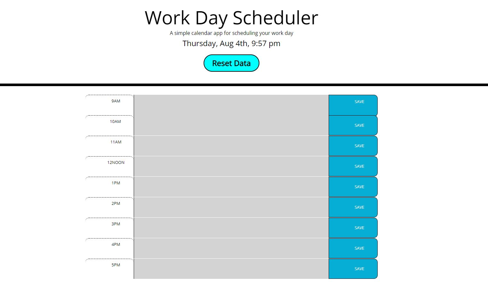

# Work Day Scheduler

## User Story
### AS A USER:
* I am looking for a application to write and maintain my daily work schedule

### SO THAT:
* I can keep track of my activites according to the time table and save it.

## Description
### A simple calendar application that allows a user to save events for each hour of the day.
* User can save events and still maintain the data even if the browser is reloaded.
* A reset button is provided to clear all the data.

### A screencapture of my webpage looks like: 

## Technologies Used:

## License

## URLs
GitHub Repository Link: https://github.com/jatin1211/Work-Day-Scheduler

## Contributors
- [Jatin Saini](https://github.com/jatin1211)

